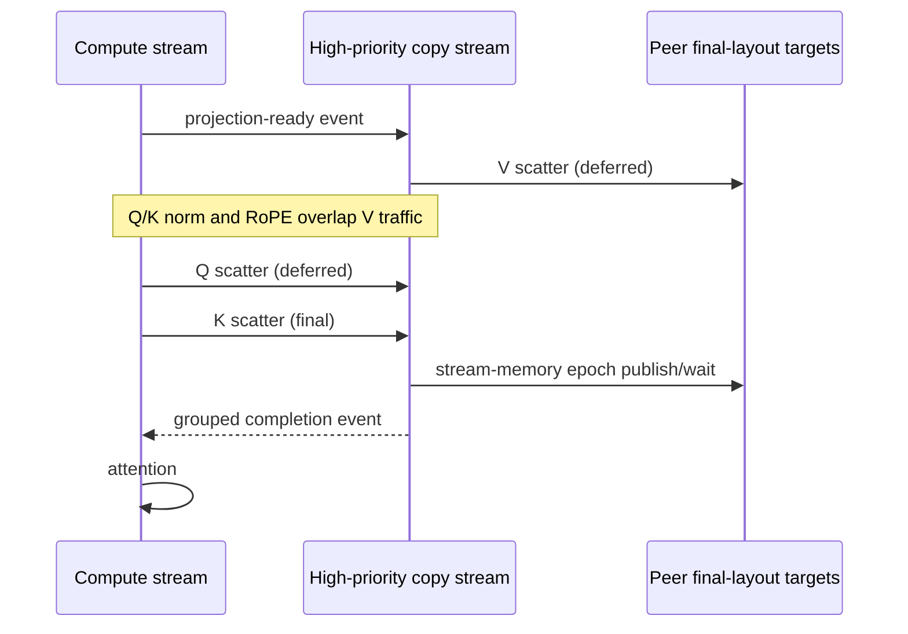

# CUDA IPC Ulysses: Overlapping Attention Communication on H100

Ulysses sequence parallelism redistributes Q, K, and V from sequence-parallel layout to head-parallel layout before
attention. The standard TeleFuser path uses PyTorch/NCCL All-to-All. It is portable and remains the fallback, but the
first scatter can leave both avoidable layout work and communication on the attention critical path.

This article describes TeleFuser's optional, same-host CUDA IPC backend. It copies strided projection views directly
into cached peer buffers in their final attention layout, uses a high-priority CUDA stream for Copy Engine traffic,
and groups independent Q/K/V submissions behind one GPU-side completion handshake. MiniMax H3 and LingBot-World v2
then schedule V early enough to overlap its transfer with Q/K preprocessing.

The article does **not** claim that Ulysses, V-first scheduling, one-sided GPU communication, or Copy Engine
All-to-All is new. The [Related Work](#related-work) section identifies the closest public systems and states the
narrower engineering contribution made here.

## Validation Snapshot

| Field | Value |
|---|---|
| Status | `validated` |
| Implementation revision | `819c238` |
| Validation date | 2026-08-06 |
| GPU | 4 x NVIDIA H100 80 GB HBM3 (SM90) |
| Software | Python 3.11.13, PyTorch 2.11.0+cu128, CUDA 12.8, NCCL 2.28.9 |
| Optional extension | Source-built SM90 `tf-kernel` wheel |
| Scope | One host with CUDA peer access; BF16 and FP16 projection tensors |

These results are point measurements for this environment, not performance guarantees for other topologies,
versions, models, or workloads.

## Baseline and Bottleneck

For a local input with shape `(B, S_local, H_global, D)`, Ulysses scatter produces
`(B, S_global, H_local, D)`. A conventional implementation first makes each destination rank's head slice contiguous,
runs All-to-All, and then establishes the layout expected by attention. A fused QKV projection adds another problem:
the V tensor is a valid strided view of the projection output, but packing Q, K, and V for a conventional collective
introduces an extra copy before communication can begin.

Q and K usually require normalization and RoPE after projection, while V does not. Waiting until all three are ready
therefore discards a useful overlap window:

```text
baseline:  fused QKV projection -> Q/K norm + RoPE -> pack QKV -> All-to-All -> attention
```

The optimization targets the first Ulysses scatter only. Standalone collectives and the post-attention output gather
stay on PyTorch/NCCL because that path was faster in the measured shapes and avoids broadening the custom protocol.

## Design Goals

The backend was designed to:

- move Q/K/V without consuming SM execution capacity for the data copy;
- accept the strided V view from a fused QKV projection without a packing copy;
- write directly into the peer's final `(B, S_global, H_local, D)` layout;
- reuse peer mappings and destination allocations across repeated denoising layers and steps;
- submit Q, K, and V independently while paying one grouped completion handshake;
- remain optional and preserve the existing NCCL behavior when eligibility checks fail; and
- tie peer-buffer lifetime to the model without adding a worker-level shutdown collective.

It is not a multi-host transport, a replacement for NCCL, or a new public pipeline configuration surface.

## Backend Architecture

### Cached final-layout targets

On PyTorch 2.11 or newer, the preferred backend allocates final-layout targets with PyTorch Symmetric Memory and uses
`rendezvous()` to obtain mapped peer buffers. The source-built extension only supplies the pitched Copy Engine copy
and stream-memory completion primitives. On older PyTorch versions, the original CUDA IPC mapping backend remains a
fallback. Targets are cached by tag, direction, output shape, dtype, and device, with a maximum of 12 entries.

### Strided Copy Engine scatter

`tf-kernel` implements the transfer with `cudaMemcpy2DAsync`. The source pitch comes from the input stride, allowing
the non-contiguous V view of a fused QKV tensor as long as heads and head channels remain contiguous within each
sequence row. The destination pitch and offset place every source rank directly into the receiving rank's final
sequence-major output tensor.

This combines what would otherwise be packing, communication, and receive-side relayout into peer copies issued on a
high-priority CUDA stream. The caller stream records a readiness event; the communication stream waits for that event
before reading the projection output.

### One grouped GPU-memory handshake

Tagged calls can defer completion with `barrier=False`. Q, K, and V remain separate transfers, but the final tagged
call publishes an epoch to every peer with `cuStreamWriteValue64` and waits for every peer epoch with
`cuStreamWaitValue64`. The three transfers consequently share one GPU-side handshake without a CPU barrier or an SM
communication kernel.

The returned handles insert a completion event into the caller stream only when their tensors are consumed.



## Model Scheduling

MiniMax H3 obtains Q, K, and V as views of one fused projection. It submits the strided V view immediately, performs
Q/K normalization and RoPE on the compute stream, then submits tagged Q and K transfers. K carries the final grouped
barrier:

```text
fused QKV projection
  |-- copy stream: V scatter --------------------|
  `-- compute stream: Q/K norm + RoPE
                     |-- Q scatter -- K scatter -- grouped completion -> attention
```

LingBot-World v2 similarly submits V before Q projection, Q before K projection, and uses K as the completion point.
Other eligible TeleFuser attention implementations use tagged Q/K/V calls while retaining their model-specific
projection order.

## Eligibility and Fallback

TeleFuser lazily creates the optimized backend only when:

- the input is a CUDA tensor and execution is not inside `torch.compile`;
- the source-built `tf-kernel` wheel exports the pitched copy and stream-memory barrier operators; and
- the Ulysses group is a supported same-host peer-access topology.

PyTorch 2.11+ first selects Symmetric Memory for allocation and peer mapping. Older versions try the CUDA IPC mapping
backend, and either path falls back to PyTorch/NCCL when capability checks fail.

Initialization or the first grouped submission may fall back to PyTorch/NCCL. Once one operation in a tagged group
has started, switching collective protocols would violate rank ordering, so a later failure is raised instead of
attempting an unsafe mid-group fallback.

Output gather remains on NCCL. This split is deliberate: the optimization is selected for the projection scatter
where strided inputs, final-layout writes, and preprocessing overlap provide the measured opportunity.

## Resource Ownership and Shutdown

The model owns one shared Ulysses communicator for all of its attention blocks. That communicator owns the
communication stream, target cache, peer mappings, and GPU-memory barrier. Model offload or destruction releases the
backend locally; `ParallelWorker` no longer imports a transport-specific cleanup function or runs a shutdown
collective before destroying the process group. PyTorch Symmetric Memory therefore manages the preferred mapping
lifetime, while the CUDA IPC fallback closes only its locally imported handles.

Cross-worker tensor transport remains separate. `WorkerTensorChannel` owns its producer pools and consumer mappings;
`ParallelWorker` owns only the child process and distributed process-group lifecycle.

## Correctness and Profiling

Validation covered:

- exact BF16 and FP16 scatter/gather against constructed rank-wise results;
- non-contiguous strided V input;
- independent tagged Q/K/V transfers and cached target pointer reuse;
- 64 grouped stress iterations with rank-skewed GPU delay;
- MiniMax H3 Ulysses2, Ulysses4, and TP2+Ulysses2 parity against dense execution;
- bounded cache behavior, model-owned release, NCCL fallback, and failure-after-group-start semantics;
- four-rank tensor-channel IPC refcounter isolation; and
- complete LingBot service shutdown with one Ctrl-C and no CUDA IPC lifetime warning.

The MiniMax H3 CUDA trace measured **157.7 us** during which the V Copy Engine transfer overlapped Q/K normalization
and RoPE preprocessing. This proves that the intended concurrency occurred on the measured H100 run; it does not by
itself attribute the entire end-to-end speedup to that overlap.

## Performance Results

### LingBot-World v2 direct path

The default 832x480 request generated 77 frames in five chunks at a 16 FPS playback target. The steady summary
excludes chunk 0 and covers four 16-frame chunks.

| Communication path | Steady compute FPS | Chunk mean / p50 / p90 | Slowest chunk |
|---|---:|---:|---:|
| Earlier NCCL path (`540b579`) | 17.14 | 0.9335 / 0.9409 / 0.9410 s | 1.0058 s |
| Tagged Q/K/V CUDA IPC path | **19.08** | **0.8385 / 0.8415 / 0.8706 s** | **0.9040 s** |

The point measurement improves steady compute FPS by approximately **11.3%**. The metric includes condition handling,
DiT, clean-KV update, spatial VAE decode, GPU-to-CPU transfer, and frame conversion. It excludes model loading,
LiveKit pacing and encoding, network delivery, and client rendering.

The one-minute lossless AIPerf replay completed 957 generated frames across 60 chunks at **17.5824 steady target
compute FPS**, with 1/1 session successful. That run also validates sustained KV-cache capacity and delivery, but it
is not a communication-only benchmark.

### MiniMax H3 four-GPU profile

The frozen 768p, five-second, 50-step T2VA request used the resident Ulysses2 x TP2 profile. Each row starts a fresh
pipeline, performs one unmeasured warmup, and measures the second request. To expose the communication change, the
table compares the measurements recorded immediately before the backend (`ebbcf9f`, PyTorch/NCCL scatter) with the
measurements after it (`1d20814`, tagged CUDA IPC scatter). Each row holds attention and cache configuration constant.

| Fixed configuration | NCCL pipeline / DiT | CUDA IPC pipeline / DiT | Pipeline reduction | DiT reduction |
|---|---:|---:|---:|---:|
| FlashAttention 4, cache disabled | 79.10 / 76.48 s | **77.32 / 74.64 s** | **2.25%** | **2.41%** |
| SageAttention 2_8_8 SM90, cache disabled | 75.96 / 73.37 s | **72.41 / 69.85 s** | **4.67%** | **4.80%** |
| FlashAttention 4, AdaTaylorCache | 43.53 / 40.87 s | **42.39 / 39.82 s** | **2.62%** | **2.57%** |

The optimization reduces both pipeline and DiT latency in all three fixed configurations, with the largest measured
pipeline reduction, **4.67%**, on the SageAttention run. The 157.7 us CUDA-trace overlap provides mechanism-level
evidence for the same path, while the table shows that the change survives full-pipeline execution.

This is a revision-level before/after comparison from separate fresh runs, not an in-process backend toggle. The
documented hardware, request, warmup policy, and parallel profile match, and the implementation commit changes the
communication path under test, but the percentages can still include ordinary run-to-run variance. A repeated
matched A/B harness and NCCL 2.28 zero-CTA baseline remain future work.

### PyTorch-owned mapping ablation

A follow-up set of in-process four-H100 MiniMax H3 runs switched only the grouped scatter backend while retaining
the same V-first attention code. Medians use three repeats of five measured iterations after three warmups.

| Production shape | PyTorch/NCCL | Legacy CUDA IPC | PyTorch Symmetric Memory | SymmMem vs NCCL |
|---|---:|---:|---:|---:|
| Ulysses4 | 3.056 ms | 2.968 ms | **2.970 ms** | **-2.82%** |
| TP2 + Ulysses2 | 2.866 ms | 2.601 ms | **2.589 ms** | **-9.67%** |

The PyTorch-owned Ulysses4 path is within 0.08% of the legacy IPC implementation, while TP2+Ulysses2 is 0.48% faster. Both remove custom target and barrier
mapping ownership. An initial implementation using `SymmetricMemory.barrier()` measured 4.46 ms because its GPU
barrier kernel competed with Q/K work. Keeping PyTorch allocation and rendezvous while retaining the stream-memory
handshake restored the overlap. This ablation is the clearest measurement of the transport design itself; the full
pipeline table above includes all model stages and cumulative denoising work.


## Reproduction

Build the optional wheel for H100 using the repository Makefile:

```bash
cd tf-kernel
make build-sm90 PYTHON=/path/to/venv/bin/python
```

Run the four-GPU transport correctness test from `tf-kernel/`:

```bash
torchrun --standalone --nproc-per-node=4 \
  tests/distributed/ulysses_correctness.py
```

Run MiniMax H3 distributed parity and export the overlap trace from the repository root:

```bash
pytest -q -s tests/integration/test_minimax_h3_distributed.py

torchrun --standalone --nproc-per-node=4 \
  tools/validation/profile_minimax_h3_ulysses_overlap.py \
  --output /tmp/minimax-h3-ulysses-trace
```

The model-level benchmark commands and metric boundaries are maintained in the
[MiniMax H3 example](https://github.com/Tele-AI/TeleFuser/tree/main/examples/minimax_h3#measured-four-gpu-profile),
[LingBot example](https://github.com/Tele-AI/TeleFuser/tree/main/examples/lingbot#validated-four-h100-real-time-gate), and
[AIPerf benchmark guide](../benchmark_aiperf.md).

## Related Work

### DeepSpeed-Ulysses and USP

[DeepSpeed-Ulysses](https://arxiv.org/abs/2309.14509) introduced the sequence-to-head All-to-All formulation used by
this backend. [USP](https://arxiv.org/abs/2405.07719) combines Ulysses and Ring Attention and analyzes their topology
and scaling tradeoffs. TeleFuser does not change the Ulysses decomposition; it specializes the same-host projection
scatter transport and schedule.

### CoCoDiff

[CoCoDiff](https://arxiv.org/abs/2604.14561) explicitly describes V-First scheduling: start V communication and hide
it behind Q/K normalization and RoPE. This is the closest scheduling precedent and the same core dependency insight
used by TeleFuser. CoCoDiff targets Intel GPU tiles on Aurora and combines V-First with Tile-Aware Parallel All-to-All
and temporal selective communication. TeleFuser's narrower contribution is a working NVIDIA/PyTorch implementation
using strided fused-projection views, CUDA IPC final-layout targets, grouped GPU-memory completion, lifecycle handling,
and transparent NCCL fallback.

### NCCL Copy Engine collectives

[NCCL 2.28](https://developer.nvidia.com/blog/fusing-communication-and-compute-with-new-device-api-and-copy-engine-collectives-in-nvidia-nccl-2-28/)
added native AllToAll and Copy Engine collectives. Its
[zero-CTA mode](https://docs.nvidia.com/deeplearning/nccl/user-guide/docs/usage/bufferreg.html#zero-cta-optimization)
uses symmetrically registered windows to free SM capacity in an NVLink domain. It is a direct transport-level
alternative and should be included in future ablations. The TeleFuser backend predetermines the Ulysses destination
layout, accepts pitched projection views, and integrates model-specific grouped scheduling; it does not claim to be
the first Copy Engine All-to-All implementation.

### PyTorch Symmetric Memory

[PyTorch Symmetric Memory](https://docs.pytorch.org/docs/main/symmetric_memory.html) exposes mapped peer buffers,
signal pads, and one-sided operations for building GPU communication. TeleFuser now uses it on PyTorch 2.11+ for
target and barrier allocation, rendezvous, peer mapping, and model-owned lifetime. The source-built extension remains
responsible for the pitched `cudaMemcpy2DAsync` layout and the non-SM stream-memory handshake. Older PyTorch versions
retain the CUDA IPC mapping fallback.

### SwiftFusion

[SwiftFusion](https://arxiv.org/abs/2601.20273) uses one-sided NVSHMEM communication and topology-aware combinations
of Ulysses, Ring, and Torus Attention to reduce synchronization and overlap multi-node communication. TeleFuser's path
is single-host, Copy Engine based, and focused on the pre-attention Ulysses scatter rather than a new distributed
attention algorithm.

## Limitations and Next Measurements

- Only four H100 80 GB GPUs on one host were validated. SM80, SM100, PCIe-only, eight-GPU, and multi-node behavior is
  not established by these results.
- The preferred Symmetric Memory path requires PyTorch 2.11+; its API is still alpha, so the backend remains capability-gated.
- The current benchmark does not isolate the contribution of target caching, pitched copies, grouped completion,
  stream priority, and V-first scheduling individually.
- NCCL 2.28 zero-CTA AllToAll still needs matched model-level comparisons before making a broader
  transport-performance claim.
- Cache misses require collective setup, and eviction intentionally uses synchronization to make mapping closure safe.

The next useful experiment is a repeated model-level ablation against NCCL 2.28 zero-CTA across Ulysses2 and
Ulysses4. The supported claim remains narrow: PyTorch-owned peer mappings preserve the measured V/QK overlap and
match the legacy IPC path on the tested H100 configuration while simplifying ownership and shutdown.
