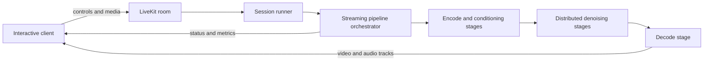

# World Model Streaming Inference

World model streaming inference keeps a model and its execution pipeline resident while repeatedly accepting
conditioning or control input, preserving session state, and emitting ordered media chunks. It is different from
token streaming in an LLM and from returning one completed video after an offline generation request.

TeleFuser provides this execution model for real-time world models and other multimodal generation workloads that
need continuous, low-latency visual output.

## Batch Inference and Streaming Inference

| Concern | Batch video inference | World model streaming inference |
|---------|-----------------------|---------------------------------|
| Execution unit | One request | A long-lived session |
| Input | Prompt and optional media | Initial media plus ongoing controls or conditions |
| Output | One completed artifact | Ordered video/audio chunks and status events |
| State | Request-scoped | Retained across session chunks |
| Scheduling | Request pipeline | Stateful actor stages with bounded queues and backpressure |
| Transport | HTTP task APIs | LiveKit WebRTC media and reliable data messages |

Batch and streaming modes use the same pipeline and stage abstractions where practical. Streaming adds session
ownership, chunk ordering, admission, cancellation, retained state, and transport lifecycle management.

## TeleFuser Runtime Path



The session runner owns user-facing lifecycle and transport state. The streaming pipeline orchestrator owns stage
ordering, bounded artifact edges, backpressure, cancellation, and cleanup. Distributed workers execute model stages
with tensor, sequence, pipeline, or FSDP parallelism according to the selected pipeline configuration.

See the [streaming scheduler](stream_scheduler.md), [stream server](stream_server.md),
[communication architecture](communication.md), and [parallel inference](parallel.md) guides for the detailed
contracts.

## Supported Streaming Workloads

| Workload | Streaming behavior | Entry point |
|----------|--------------------|-------------|
| LingBot-World v2 | Camera-controlled bidirectional world-model sessions | [LingBot examples](https://github.com/Tele-AI/TeleFuser/tree/main/examples/lingbot) |
| LingBot-World-Fast | Causal-fast interactive sessions with reliable controls | [LingBot examples](https://github.com/Tele-AI/TeleFuser/tree/main/examples/lingbot) |
| LiveAct | Speech-driven video generation | [LiveAct examples](https://github.com/Tele-AI/TeleFuser/tree/main/examples/liveact) |
| FlashVSR | Progressive video super-resolution | [FlashVSR examples](https://github.com/Tele-AI/TeleFuser/tree/main/examples/flashvsr) |

The general batch service also covers multimodal image, video, and joint audio-video generation through
`telefuser serve`. See the [service guide](service.md) and the supported-model table on the [documentation
home page](index.md).

## Measured Real-Time Gate

The checked-in LingBot-World v2 profile has been validated on four H100 80 GB GPUs at 832x480 with a 16 FPS playback
target. Its current 77-frame gate reaches 17.14 synchronized target-side compute FPS after warmup.

This is a pipeline compute measurement. Model loading, LiveKit encoding, network delivery, and client rendering are
measured separately. Use the [reproducible AIPerf benchmark](benchmark_aiperf.md#current-four-h100-real-time-gate)
for the launch command, workload, warmup policy, and phase timings.

## Start a Streaming Service

```bash
TF_MODEL_ZOO_PATH=/path/to/model_zoo \
CUDA_VISIBLE_DEVICES=0,1,2,3 \
telefuser stream-serve examples/lingbot/lingbot_world_v2_image_to_video_h100.py \
  --livekit-url ws://127.0.0.1:7880 \
  --livekit-api-key devkey --livekit-api-secret secret \
  --num-workers 1 --worker-gpu-map 0,1,2,3 \
  --max-sessions-per-worker 2 --port 8088 --skip-validation
```

The loopback URL and static credentials are for trusted local development only. Follow the
[stream server guide](stream_server.md) for LiveKit Cloud, self-hosted deployment, room roles, TURN configuration,
capacity planning, and browser integration.
