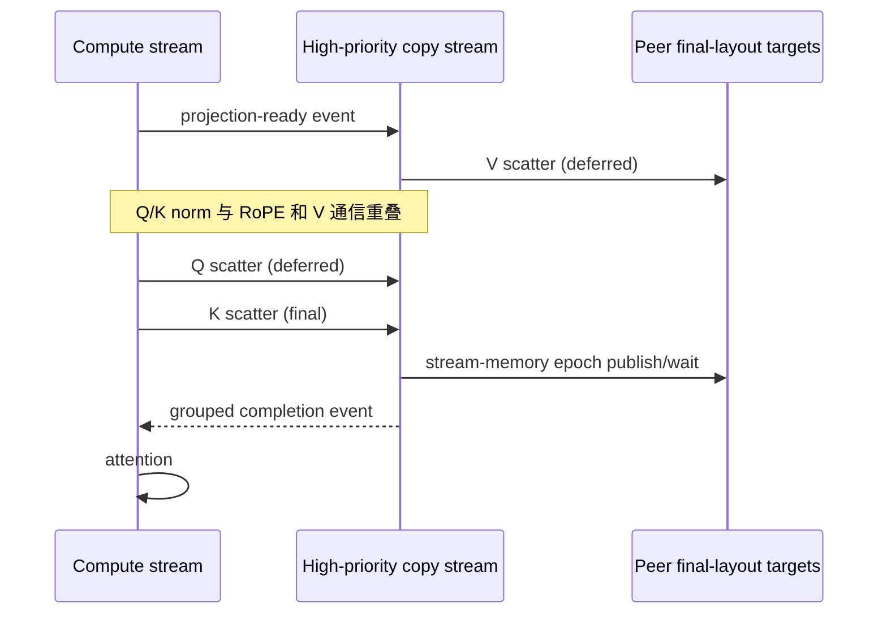

# CUDA IPC Ulysses：在 H100 上重叠 Attention 通信

Ulysses sequence parallelism 在 attention 之前把 Q、K、V 从 sequence-parallel 布局重排到 head-parallel
布局。TeleFuser 的标准路径使用 PyTorch/NCCL All-to-All，可移植性好并始终作为 fallback，但第一次 scatter
仍可能把可避免的布局处理和通信留在 attention 关键路径上。

本文介绍 TeleFuser 的单机 Copy Engine 优化。PyTorch 2.11+ 优先用 Symmetric Memory 管理 target allocation、
peer mapping 和生命周期，源码构建的 `tf-kernel` 负责 pitched `cudaMemcpy2DAsync` 和不占 SM 的 stream-memory
握手。较旧 PyTorch 继续使用 CUDA IPC mapping fallback。MiniMax H3 和 LingBot-World v2 还会提前提交 V，
把 V 传输隐藏在 Q/K 预处理之后。

本文不主张 Ulysses、V-first、单边 GPU 通信或 Copy Engine All-to-All 本身是新方法；[Related Work](#related-work)
会列出最接近的公开工作，并界定这里更窄的工程贡献。

## 验证快照

| 字段 | 值 |
|---|---|
| 状态 | `validated` |
| 原始实现 revision | `819c238` |
| 验证日期 | 2026-08-06 |
| GPU | 4 x NVIDIA H100 80 GB HBM3（SM90） |
| 软件 | Python 3.11.13、PyTorch 2.11.0+cu128、CUDA 12.8、NCCL 2.28.9 |
| 可选扩展 | 源码构建的 SM90 `tf-kernel` wheel |
| 范围 | 单机 CUDA peer access；BF16/FP16 projection tensor |

这些结果是当前环境下的点测，不代表其他拓扑、版本、模型或 workload 的性能保证。

## 基线与瓶颈

本地输入 `(B, S_local, H_global, D)` 经过 Ulysses scatter 后变成
`(B, S_global, H_local, D)`。常规实现先把各目标 rank 的 head slice 变为 contiguous，再执行 All-to-All，
然后建立 attention 所需布局。对于 fused QKV projection，V 是合法的 strided view；常规 collective 的 packing
会在真正通信之前额外复制一次。

Q/K 通常还要执行 normalization 和 RoPE，而 V 不需要。等待三者全部完成会丢掉一个可利用的重叠窗口：

```text
基线：fused QKV projection -> Q/K norm + RoPE -> pack QKV -> All-to-All -> attention
```

优化只覆盖 attention 之前的 Ulysses scatter。单次 collective 和 attention 之后的 output gather 继续使用
PyTorch/NCCL，因为在实测 shape 下该路径更快，也能限制自定义协议范围。

## 设计目标

- 数据复制不占用 SM 执行资源；
- 直接接收 fused QKV projection 的 strided V view，不增加 packing copy；
- 直接写入对端最终 `(B, S_global, H_local, D)` 布局；
- 在重复 denoising layer 和 step 间复用 peer mapping 与 target allocation；
- Q、K、V 独立提交，但只支付一次 grouped completion；
- 能力检测失败时保持 NCCL 行为；
- peer buffer 生命周期跟随模型，不在 worker 退出路径增加 collective。

它不是多机 transport，不取代 NCCL，也不增加新的公开 pipeline 配置字段。

## Backend 架构

### 缓存最终布局 target

PyTorch 2.11+ 的首选 backend 使用 Symmetric Memory 分配最终布局 target，并通过 `rendezvous()` 获取 mapped
peer buffer。较旧版本使用原 CUDA IPC handle exchange。Target 按 tag、方向、输出 shape、dtype 和 device 缓存，
最多保留 12 个 entry，避免动态 shape 无界占用 HBM。

### Strided Copy Engine scatter

`tf-kernel` 使用 `cudaMemcpy2DAsync`。source pitch 直接来自输入 stride，因此 fused QKV 的非 contiguous V view
无需 packing，只要每个 sequence row 内的 head 和 head channel 连续。destination pitch 与 offset 让每个源 rank
直接写入接收 rank 的最终 sequence-major output。

传输在一条高优先级 CUDA stream 上执行。caller stream 记录 readiness event，communication stream 等待该 event
后才读取 projection output。

### 一次 grouped GPU-memory handshake

带 tag 的调用可通过 `barrier=False` 延迟完成。最终调用用 `cuStreamWriteValue64` 向全部 peer 发布 epoch，再用
`cuStreamWaitValue64` 等待全部 peer。Q/K/V 因此共享一次 GPU-side handshake，不需要 CPU barrier，也不启动
占用 SM 的通信 kernel。



## 模型调度

MiniMax H3 从一次 fused projection 获得 Q/K/V view。它立即提交 strided V，在 compute stream 上执行 Q/K norm
和 RoPE，然后提交 Q、K；K 携带最终 grouped barrier：

```text
fused QKV projection
  |-- copy stream: V scatter --------------------|
  `-- compute stream: Q/K norm + RoPE
                     |-- Q scatter -- K scatter -- grouped completion -> attention
```

LingBot-World v2 同样在 Q projection 前提交 V、在 K projection 前提交 Q，并以 K 作为完成点。其他 eligible
attention 保留各自 projection 顺序，但共用 tagged Q/K/V 协议。

## 资格与 fallback

TeleFuser 仅在以下条件满足时延迟创建优化 backend：

- 输入是 CUDA tensor，且当前不在 `torch.compile` 内；
- 源码构建的 `tf-kernel` wheel 导出 pitched copy 和 stream-memory barrier operator；
- Ulysses group 是受支持的单机 peer-access 拓扑。

PyTorch 2.11+ 优先选择 Symmetric Memory；旧版本尝试 CUDA IPC mapping；任一路径失败后都回退到
PyTorch/NCCL。一旦 tagged group 已开始，切换 collective 协议会破坏 rank ordering，因此后续失败会直接抛出，
不会执行不安全的中途 fallback。

## 资源所有权与退出

模型为全部 attention block 共享一个 `UlyssesCommunicator`。它拥有 communication stream、target cache、peer
mapping 和 GPU-memory barrier。模型 offload 或销毁时在本地释放 backend；`ParallelWorker` 不再导入
transport-specific cleanup，也不会在 `destroy_process_group()` 前执行额外 shutdown collective。

首选路径的 mapping 生命周期由 PyTorch Symmetric Memory 管理；CUDA IPC fallback 只关闭本地 import 的 handle。
跨 worker tensor transport 仍属于 `WorkerTensorChannel`，不与该 communicator 共享所有权。

## 正确性与 profiling

验证范围包括：

- BF16/FP16 scatter/gather 与按 rank 构造的预期结果完全一致；
- 非连续 strided V input；
- 独立 tagged Q/K/V、target cache reuse 和 failure-after-group-start 语义；
- MiniMax H3 Ulysses2、Ulysses4、TP2+Ulysses2 parity；
- 模型持有的释放、NCCL fallback 和一次完成的 torchrun teardown；
- LingBot 服务一次 Ctrl-C 完整退出且无 CUDA IPC 生命周期警告。

MiniMax H3 CUDA trace 测得 V Copy Engine transfer 与 Q/K normalization、RoPE preprocessing 之间存在
**157.7 us** 重叠。它证明实测 H100 上发生了预期并发，但不能把全部端到端收益都归因于这一段重叠。

## 性能结果

### LingBot-World v2 直接路径

默认 832x480 请求以 16 FPS target 生成 77 帧、五个 chunk。steady summary 排除 chunk 0。

| 通信路径 | Steady compute FPS | Chunk mean / p50 / p90 | 最慢 chunk |
|---|---:|---:|---:|
| 较早 NCCL 路径（`540b579`） | 17.14 | 0.9335 / 0.9409 / 0.9410 s | 1.0058 s |
| Tagged Q/K/V Copy Engine 路径 | **19.08** | **0.8385 / 0.8415 / 0.8706 s** | **0.9040 s** |

steady compute FPS 点测提升约 **11.3%**。该指标包含 condition handling、DiT、clean-KV update、spatial VAE
decode、GPU-to-CPU transfer 和 frame conversion，不包含模型加载、网络交付和 client rendering。

### MiniMax H3 完整 pipeline

固定 768p、5 秒、50-step T2VA 请求使用常驻 Ulysses2 x TP2；每行一次 warmup 后测第二次请求。

| 固定配置 | NCCL pipeline / DiT | Copy Engine pipeline / DiT | Pipeline 降幅 | DiT 降幅 |
|---|---:|---:|---:|---:|
| FlashAttention 4，关闭 cache | 79.10 / 76.48 s | **77.32 / 74.64 s** | **2.25%** | **2.41%** |
| SageAttention 2_8_8 SM90，关闭 cache | 75.96 / 73.37 s | **72.41 / 69.85 s** | **4.67%** | **4.80%** |
| FlashAttention 4，AdaTaylorCache | 43.53 / 40.87 s | **42.39 / 39.82 s** | **2.62%** | **2.57%** |

### PyTorch-owned mapping 消融

四 H100 MiniMax H3 的两组进程内测试只切换 grouped scatter backend。中位数来自三次 repeat，每次五个测量
iteration，之前执行三次 warmup。

| Production shape | PyTorch/NCCL | Legacy CUDA IPC | PyTorch Symmetric Memory | SymmMem 相对 NCCL |
|---|---:|---:|---:|---:|
| Ulysses4 | 3.056 ms | 2.968 ms | **2.970 ms** | **-2.82%** |
| TP2 + Ulysses2 | 2.866 ms | 2.601 ms | **2.589 ms** | **-9.67%** |

PyTorch-owned Ulysses4 路径与旧 IPC 实现只差 0.08%，TP2+Ulysses2 则快 0.48%。两者都移除了自定义 target/barrier mapping 所有权。最初直接使用
`SymmetricMemory.barrier()` 的版本测得 4.46 ms，因为 GPU barrier kernel 会与 Q/K 工作争用 SM；改为
“PyTorch allocation/rendezvous + stream-memory handshake”后恢复了 overlap。

## 复现

```bash
cd tf-kernel
make build-sm90 PYTHON=/path/to/venv/bin/python

torchrun --standalone --nproc-per-node=4 tests/distributed/ulysses_correctness.py

pytest -q -s tests/integration/test_minimax_h3_distributed.py

torchrun --standalone --nproc-per-node=4 \
  tools/validation/benchmark_ulysses_symmetric_memory.py \
  --group-size 4 --profile minimax_h3_u4 --symmetric-backend CUDA \
  --model-level --output /tmp/ulysses-symm.json
```

## Related Work

### DeepSpeed-Ulysses 与 USP

[DeepSpeed-Ulysses](https://arxiv.org/abs/2309.14509) 提出了 sequence-to-head All-to-All 形式；
[USP](https://arxiv.org/abs/2405.07719) 组合 Ulysses 与 Ring Attention。TeleFuser 不改变 decomposition，只特化
单机 projection scatter 的 transport 和 schedule。

### CoCoDiff

[CoCoDiff](https://arxiv.org/abs/2604.14561) 明确描述 V-first：提前启动 V 通信，用 Q/K norm 和 RoPE 隐藏它。
这是最接近的调度先例。CoCoDiff 面向 Aurora Intel GPU tile；TeleFuser 的范围是 NVIDIA/PyTorch、strided
projection view、最终布局 target、grouped completion 和透明 fallback。

### NCCL 2.28 Copy Engine collective

[NCCL 2.28](https://developer.nvidia.com/blog/fusing-communication-and-compute-with-new-device-api-and-copy-engine-collectives-in-nvidia-nccl-2-28/)
增加原生 AllToAll 和 Copy Engine collective；其 [zero-CTA 模式](https://docs.nvidia.com/deeplearning/nccl/user-guide/docs/usage/bufferreg.html#zero-cta-optimization)
使用 symmetric registered window 释放 SM。它是直接 transport-level 替代方案，后续模型级消融必须包含该基线。

### PyTorch Symmetric Memory

[PyTorch Symmetric Memory](https://docs.pytorch.org/docs/main/symmetric_memory.html) 提供 mapped peer buffer、signal
pad 和 one-sided primitive。TeleFuser 在 PyTorch 2.11+ 用它管理 target/barrier allocation、rendezvous、peer
mapping 和模型生命周期；源码扩展只负责 pitched copy 与非 SM stream-memory handshake。

### SwiftFusion

[SwiftFusion](https://arxiv.org/abs/2601.20273) 使用 NVSHMEM 和 topology-aware 的 Ulysses/Ring/Torus Attention
组合重叠多机通信。TeleFuser 当前只覆盖单机 pre-attention Ulysses scatter。

## 限制与下一步

- 只验证了单机四张 H100；SM80、SM100、PCIe-only、八卡和多机表现尚未建立；
- Symmetric Memory 路径要求 PyTorch 2.11+，且 API 仍是 alpha，因此必须保持 capability gate；
- cache miss 需要 collective setup，淘汰会同步以保证 mapping 生命周期安全；
- NCCL 2.28 zero-CTA 仍需在 Ulysses2/Ulysses4 上做 matched model-level comparison。

当前可支持的结论是：PyTorch-owned peer mapping 在实测 H100 上保留 V/QK overlap，与旧 IPC 路径性能相当，
并简化了资源所有权和退出流程。
