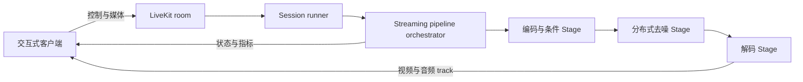

# 世界模型流式推理

世界模型流式推理会让模型及其执行流水线保持常驻，持续接收条件或控制输入、保留会话状态，并按顺序输出
媒体 chunk。它不同于大语言模型的 token streaming，也不同于完成一次离线生成后再返回完整视频。

TeleFuser 为实时世界模型以及需要连续、低时延视觉输出的其他多模态生成任务提供这种执行方式。

## 批量推理与流式推理

| 关注点 | 批量视频推理 | 世界模型流式推理 |
|--------|--------------|------------------|
| 执行单元 | 单次请求 | 长时运行的 session |
| 输入 | Prompt 和可选媒体 | 初始媒体以及持续到达的控制或条件 |
| 输出 | 一个完整 artifact | 有序视频/音频 chunk 和状态事件 |
| 状态 | 仅存在于请求内 | 跨 session chunk 保留 |
| 调度 | 请求级 pipeline | 带有界队列和 backpressure 的有状态 actor stage |
| 传输 | HTTP task API | LiveKit WebRTC 媒体和可靠数据消息 |

批量模式和流式模式会尽可能复用相同的 Pipeline 与 Stage 抽象。流式执行在此基础上增加 session 所有权、
chunk 顺序、准入、取消、状态保留和传输生命周期管理。

## TeleFuser 运行链路



Session runner 管理面向用户的生命周期和传输状态。Streaming pipeline orchestrator 管理 Stage 顺序、有界
artifact edge、backpressure、取消和清理。分布式 worker 根据所选 Pipeline 配置，通过张量并行、序列并行、
流水线并行或 FSDP 执行模型 Stage。

详细契约见[流式调度器](stream_scheduler.md)、[流式服务](stream_server.md)、
[通信架构](communication.md)和[并行推理](parallel.md)指南。

## 支持的流式任务

| 工作负载 | 流式行为 | 入口 |
|----------|----------|------|
| LingBot-World v2 | 相机控制的双向世界模型 session | [LingBot 示例](https://github.com/Tele-AI/TeleFuser/tree/main/examples/lingbot) |
| LingBot-World-Fast | 使用可靠控制消息的 causal-fast 交互式 session | [LingBot 示例](https://github.com/Tele-AI/TeleFuser/tree/main/examples/lingbot) |
| LiveAct | 语音驱动视频生成 | [LiveAct 示例](https://github.com/Tele-AI/TeleFuser/tree/main/examples/liveact) |
| FlashVSR | 渐进式视频超分辨率 | [FlashVSR 示例](https://github.com/Tele-AI/TeleFuser/tree/main/examples/flashvsr) |

通用批量服务还可以通过 `telefuser serve` 承载多模态图像、视频和联合音视频生成。完整接口见
[服务指南](service.md)，支持的模型见[文档首页](index.md)。

## 已验证的实时门禁

仓库内的 LingBot-World v2 profile 已在 4 张 H100 80 GB 上通过 832x480、16 FPS 播放目标的验证。当前
77 帧门禁在预热后达到 17.14 synchronized target-side compute FPS。

该指标只衡量 Pipeline 计算。模型加载、LiveKit 编码、网络交付和客户端渲染需要单独测量。启动命令、
workload、预热规则和逐阶段耗时见[可复现 AIPerf 基准](benchmark_aiperf.md#当前-77-帧实时计算门禁)。

## 启动流式服务

```bash
TF_MODEL_ZOO_PATH=/path/to/model_zoo \
CUDA_VISIBLE_DEVICES=0,1,2,3 \
telefuser stream-serve examples/lingbot/lingbot_world_v2_image_to_video_h100.py \
  --livekit-url ws://127.0.0.1:7880 \
  --livekit-api-key devkey --livekit-api-secret secret \
  --num-workers 1 --worker-gpu-map 0,1,2,3 \
  --max-sessions-per-worker 2 --port 8088 --skip-validation
```

Loopback URL 和静态凭证仅用于可信本地开发。LiveKit Cloud、自托管部署、room 角色、TURN 配置、容量规划
和浏览器接入方式见[流式服务指南](stream_server.md)。
